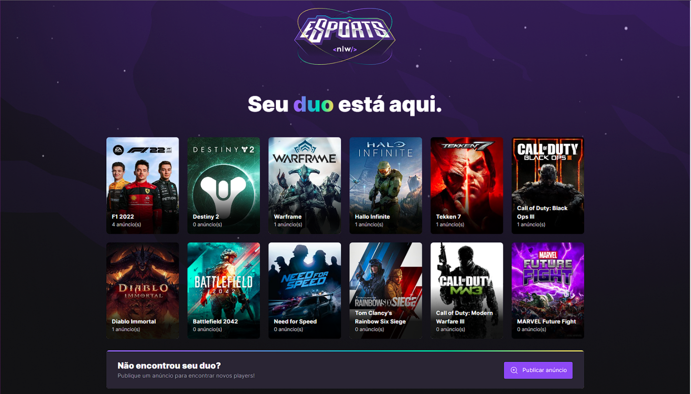

# NLW eSports

Aplicação composta pelo Front-End, Back-End e Mobile, realizado na NLW eSports da Rocketseat.

Projeto feito para ajudar os gamers a encontrar um parceiro ou parceira para jogar online seus games favoritos.

## Tecnologias utilizadas

### Backend

- [Node](https://nodejs.org)
- [Express](https://expressjs.com)
- [Prisma](https://www.prisma.io)
- [SQLite](https://www.sqlite.org/index.html)

### Web

- [React](https://reactjs.org)
- [Vite](https://vitejs.dev)
- [Tailwind](https://tailwindcss.com)
- [Radix UI](https://www.radix-ui.com)
- [React Hook Form](https://react-hook-form.com)
- [Axios](https://axios-http.com)

### App

- [React](https://reactjs.org)
- [React Native](https://reactnative.dev)
- [Expo](https://docs.expo.dev/index.html)
- [React Navigation](https://reactnavigation.org)
- [Axios](https://axios-http.com)

